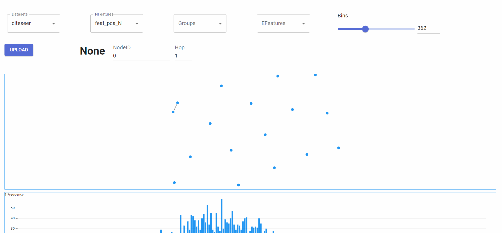
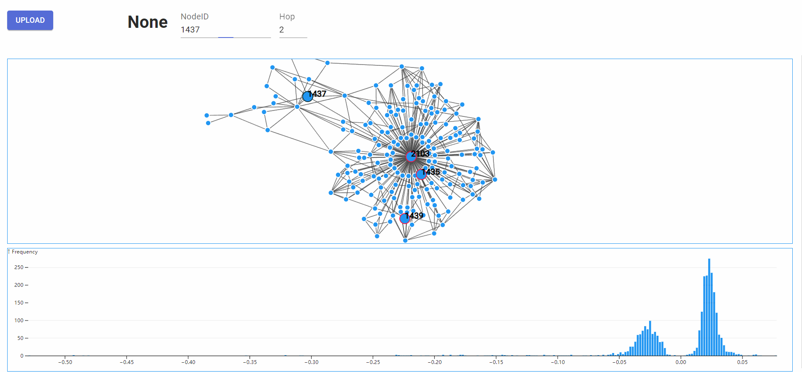

# undergraduate-project-SJTU

This is a website base visualization tool for graph.  It can help you build a highly interactive graph visualization with limited code. The website only supports [dgl](https://www.dgl.ai/) graph now.  You may learn how to use dgl to store your data [here](https://docs.dgl.ai/).

## Highlighted Features

### User-Friendly

By simply uploading your dgl graph, you can create a highly interactive graph visualization. You may complete some intuitive interactions with the visualization graph easily by selecting or clicking.

### Interactive Visualization Graphs

This tool provides graphs written by d3. The original graphs are from observable. You could find more examples [here](https://observablehq.com/@d3/charts?collection=@d3/charts).  

#### Components

We provide the following components to allow you to adjust your visualization:

- Datasets: select graphs you have been uploaded
- NFeatures: select node feature that you wish to display
- Groups : select node feature you want to use to distinguish nodes
- EFeatures : select edge feature that you wish to display in edges. Currently, we use the opacity of edge to reflect the edge feature you have selected, which means the tool only accept one number for one edge.
- NodeID : Node ID of the center node. The ID is the same as the id in the dgl graph.
- Hop : Hop of the center node.

  #### Interactions

##### Select nodes using histogram



##### Mark the node by single-clicking && Enter a node by double-clicking


##### Use groups to distinguish nodes



## Get Started

### Install Node.js

For now, the website can only be ran in debug mode.  A Node.js environment will be required. You may visit this [website](https://nodejs.org/en/) to download the latest version.

### Clone the project

```
https://github.com/yu-zhou-333/undergraduate-project-SJTU.git
```

There two parts you need to activate before seeing the pages.

### Frontend

First, cd to frontend and install the requirements using node.

```
cd ./frontend
```

```
npm install
npm start
```

or if you use yarn: 

```
yarn install
yarn start 
```

The page will be displayed at localhost:3000.

### Backend

Second, cd to backend and install requirements.

```
cd ./backend
conda env create -f backend.yaml
conda activate backend
```

then, run the following command to activate backend.

```
python server.py --logdir cache/
```

